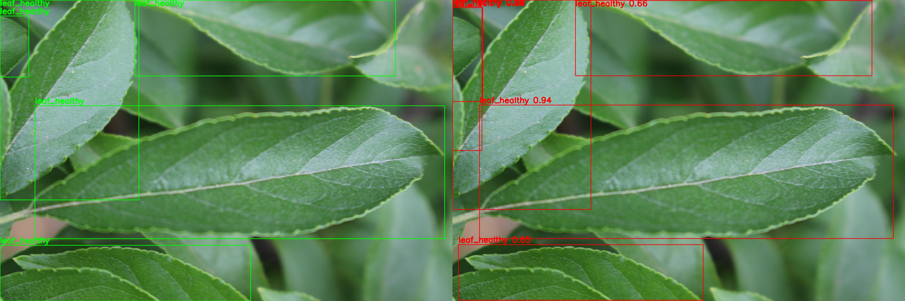
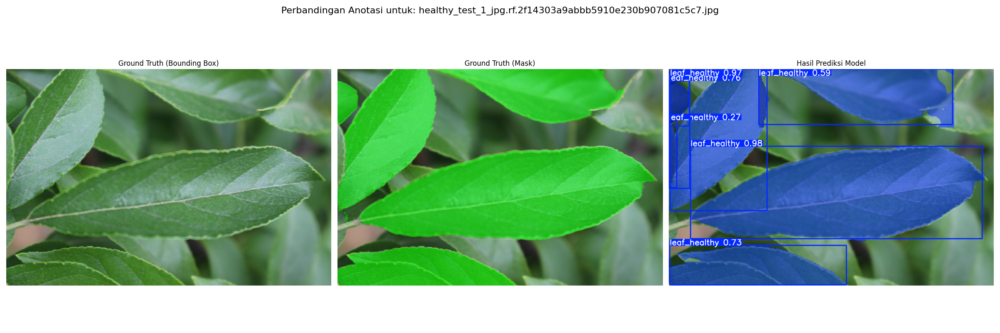
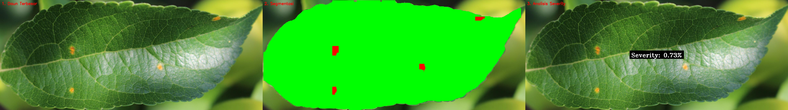

# 🌿 Plant Disease Detection & Severity Estimation using YOLOv11

🚀 Proyek ini merupakan sistem pendeteksi penyakit tanaman dan pengukuran tingkat keparahannya berbasis citra daun menggunakan YOLOv11 (varian `nano`, `small`, dan `medium`).

---

## 📁 Struktur Dataset
```
dataset/
├── objectDetection/
├── maskDaun/
└── maskLesi/
```


- **`objectDetection/`**: Dataset untuk pelatihan deteksi daun secara menyeluruh.
- **`maskDaun/`**: Dataset segmentasi daun (hasil dari SAM2).
- **`maskLesi/`**: Dataset segmentasi lesi penyakit untuk estimasi keparahan.

---

## 🧠 Model

Kami menggunakan model segmentasi YOLOv11 dengan bobot:
- `yolo11n-seg.pt` 🟢 (Nano)
- `yolo11s-seg.pt` 🔵 (Small)
- `yolo11m-seg.pt` 🟣 (Medium)

---

## 🛠️ Tahapan

1. **🖼️ Object Detection**
   - Deteksi objek daun pada citra
   - Dataset: `dataset/objectDetection/`
   - Contoh hasil:  
     

2. **🍃 Leaf Mask Segmentation**
   - Segmentasi daun dari background
   - Dataset: `dataset/maskDaun/`
   - Contoh hasil:  
     

3. **🦠 Lesion Mask Segmentation**
   - Segmentasi area penyakit/lesi pada daun
   - Dataset: `dataset/maskLesi/`
   - Contoh hasil:  
     

---

## 📊 Evaluasi

- **IoU (Intersection over Union)** untuk segmentasi
- **mAP50 & mAP50-95** dari hasil validasi
- Hasil dicatat di folder:
```
results/
├── objectDetection/
├── maskDaun/
└── maskLesi/
```

---

## 🔁 Perbandingan Varian Model

| Varian | Kecepatan | Akurasi | Keterangan       |
|--------|-----------|---------|------------------|
| `nano` | ⚡⚡⚡       | ⭐       | ultra ringan     |
| `small`| ⚡⚡        | ⭐⭐      | seimbang         |
| `medium`| ⚡         | ⭐⭐⭐     | akurasi lebih baik|

---

## 📦 Dependencies

- `ultralytics>=8.0.0`
- `opencv-python`
- `matplotlib`
- `Pillow`
- `numpy`
- `scikit-learn`

---

## 📬 Kontak

📧 M. Abiya Makruf  
✉️ Telkom University – S2 Informatika  
